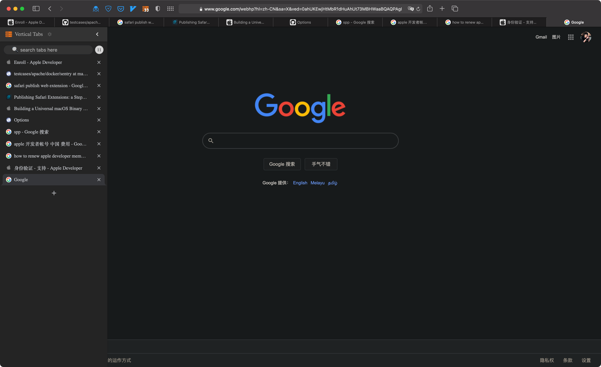

# Vertical Tabs for Safari

Vertical tabs for Safari, finally!

## Show case

**Dark theme**

**Light theme**

**Settings**

**Full Screen**

**Search**

**Pin tab**

---

## Features

- Auto show/hide sidebar.
- Dark theme support.
- Display tabs vertically in a sidebar on web pages.
- Tabs are displayed with the same style as Google Chrome.
- ~~Drag and Drop to reorder tabs.~~ API [not supported](https://developer.mozilla.org/en-US/docs/Mozilla/Add-ons/WebExtensions/API/tabs/move) by Safari
- Search and filter tabs.
- Context menu on tabs.
- Toggle the sidebar by clicking on the extension icon.
- Toggle the sidebar using the keyboard shortcut: **`Cmd + E`** (**`Ctrl + E`** on PC) ~~or `Ctrl` + `` ` `` or `Ctrl` + `Esc` or `Cmd` + `Esc` or `Opt` + `Esc` or `Alt` + `Esc`~~
  - Using keyboard shortcuts are recommended once you formed the corresponding muscle memory.
- The sidebar is resizable, and can be put on either the left or right of the browser window.

## Planned Features

- Tree styled tabs
- Please provide valuable feedback by creating a [new issue](https://github.com/wangfenjin/vertical-tabs-safari-extension/issues/new)

## 👉 👉 [Release Notes and Change log](/CHANGELOG.md)

## Credits

Built with the following template:

👉 👉 [Chrome Extension Boilerplate with React 17 and Webpack 5](https://github.com/lxieyang/chrome-extension-boilerplate-react)

---

Built with [React](https://reactjs.org/), [Webpack](https://webpack.js.org/), and ❤ by Michael Xieyang Liu | [Website](https://lxieyang.github.io) and Fenjin Wang | [Website](https://www.wangfenjin.com)
